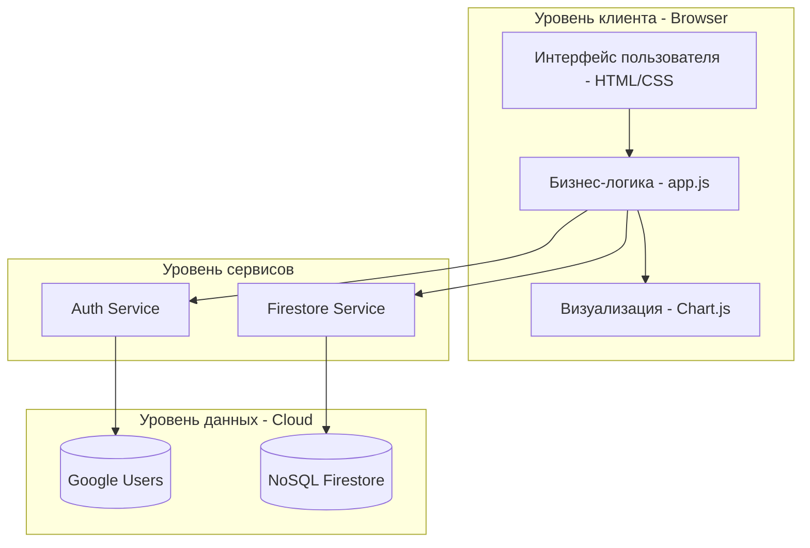
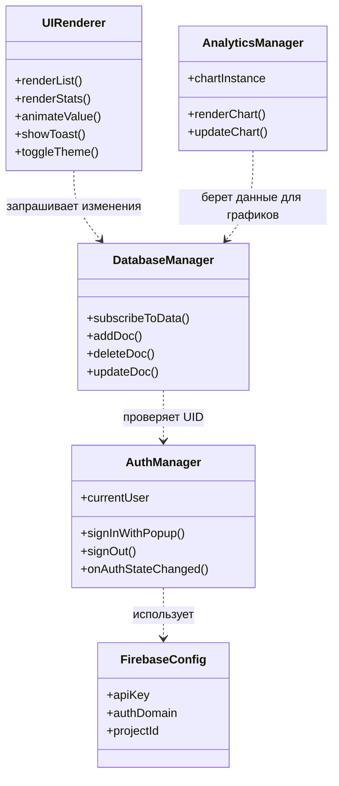

## Часть 1. Проектирование архитектуры ("To Be" — Как должно быть)

Описываем идеальную структуру нашего приложения.

1.  **Тип приложения:** Web Application, Single Page Application (SPA). Приложение выполняется на стороне клиента (браузер), обмениваясь данными с облачным бэкендом.
2.  **Стратегия развертывания:** Распределенная.
Обоснование: Приложение разделено на клиентскую часть (фронтенд), исполняемую на устройстве пользователя, и облачную часть (бэкенд-сервисы Firebase), где происходит хранение данных и обработка прав доступа. Физически компоненты системы находятся на разных узлах сети
3.  **Обоснование выбора технологий:**
    *   **Vanilla JS:** Отсутствие тяжелых фреймворков увеличивает скорость загрузки.
    *   **Firebase:** Готовая аутентификация и NoSQL БД в реальном времени.
    *   **Chart.js:** Легковесная и мощная библиотека для визуализации данных.
4.  **Показатели качества:**
    *   *Usability:* Интерфейс в стиле Glassmorphism для высокого UX.
    *   *Security:* Безопасный вход через Google (OAuth 2.0).
    *   *Performance:* Минимальный размер бандла, асинхронная загрузка данных.
5.  **Сквозная функциональность (Cross-cutting functionality):**
    *   Логирование (console wrapper).
    *   Обработка ошибок (Toast notifications).
    *   Проверка прав доступа (Auth Guard в `onAuthStateChanged`).

### 6. Структурная схема (To Be)

---

## Часть 2. Анализ архитектуры ("As Is" — Как реализовано сейчас)

Мы используем «обратное проектирование». Хотя в нашем проекте всего один файл `app.js`, внутри него четко выделены зоны ответственности.

**Диаграмма классов/модулей (As Is):**

---

## Часть 3. Сравнение и рефакторинг

### 1. Сравнение "As Is" и "To Be"
*   **To Be:** Предполагает четкое разделение на физические слои и, возможно, разные файлы/модули.
*   **As Is:** В реальности вся логика сосредоточена в одном файле `app.js`. Это «Fat Module» (толстый модуль).

### 2. Отличия и их причины
Основное отличие — **отсутствие архитектурного паттерна (например, MVC или Clean Architecture)** в коде.
*   *Причина:* Малый масштаб учебного проекта. Для проекта из 3-х файлов разделение на 5 разных файлов-сервисов могло бы излишне усложнить код на начальном этапе. Однако при росте количества функций это станет проблемой (багом будет сложнее управлять).

### 3. Пути улучшения (Рефакторинг)
Чтобы привести систему к идеалу ("To Be"), нужно:
1.  **Выделить паттерн MVC (Model-View-Controller):**
    *   *Model:* Отдельный файл `db.js` для работы с Firebase.
    *   *View:* Отдельный файл `ui.js` для манипуляций с DOM и Chart.js.
    *   *Controller:* `app.js`, который только связывает данные и интерфейс.
2.  **Использовать паттерн "Singleton":** Для управления подключением к БД.
3.  **Применить принцип "Single Responsibility":** Сейчас функция `renderList` и удаляет, и форматирует деньги, и группирует даты. Нужно разбить её на мелкие чистые функции.

---
